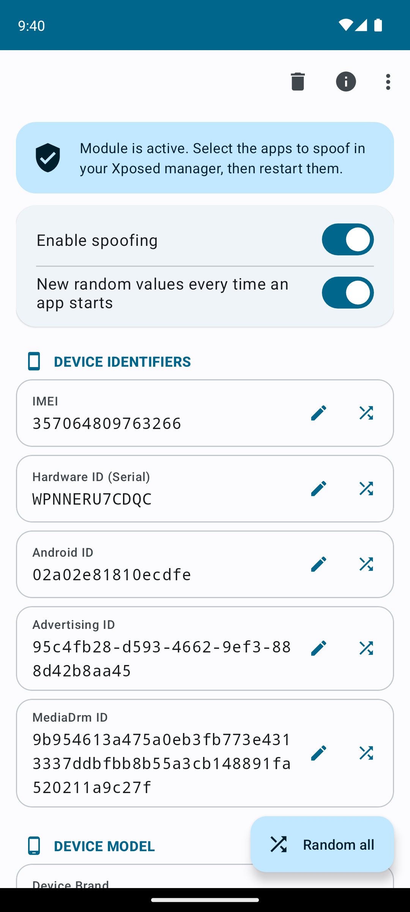
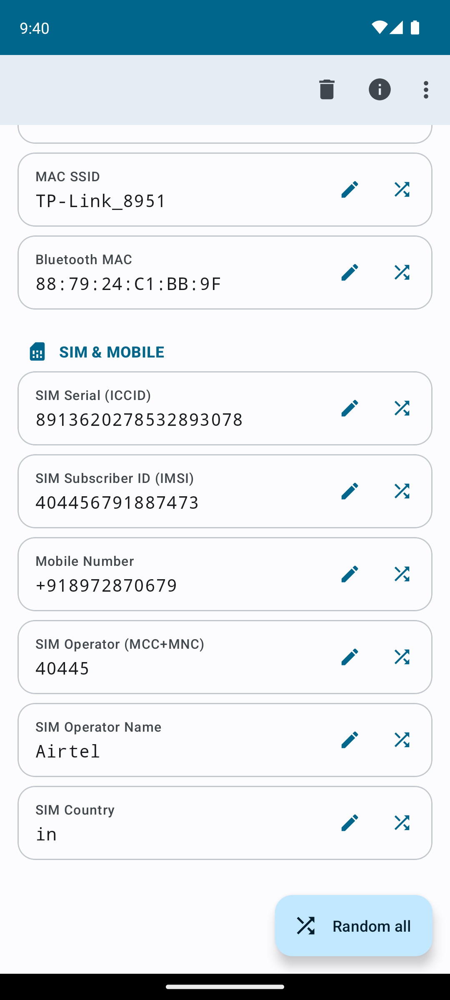
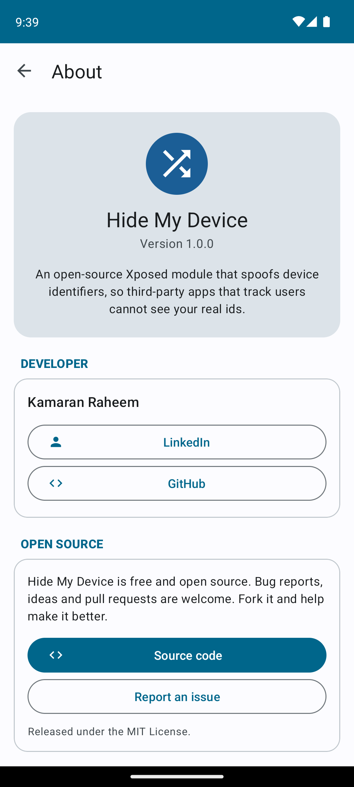

<div align="center">

# Hide My Device

**An open-source Xposed module that spoofs your device identifiers, so third-party apps that track users can't see your real ids.**

[](https://github.com/imkamaran/HideMyDevice/actions/workflows/build.yml)
[](LICENSE)


[](CONTRIBUTING.md)





</div>

---

## Why

Many apps read hardware and SIM identifiers (IMEI, Android ID, MAC addresses, advertising ID and so on) to follow you across apps, reinstalls and factory resets. Hide My Device hooks the Android APIs those apps call and hands them values you choose, or realistic random ones, so your real identifiers stay private.

You decide which apps are affected: only the apps you tick in LSPosed see spoofed values. Everything else on the device keeps working normally.

## Features

- **Spoof 18 identifiers** across four groups: device, device model, Wi-Fi & Bluetooth, SIM & mobile.
- **Edit or randomise** each value individually, or **randomise everything with one tap**.
- **Realistic random values**: IMEI and ICCID carry valid Luhn check digits; MAC addresses are valid unicast addresses; SIM values (operator code, name, country, IMSI prefix, phone country code) always belong to the same real operator; brand, manufacturer and model always match a real phone.
- **New identity on every app start** (optional): each launch of a target app gets fresh random values.
- **Master switch** to turn spoofing off without losing your values.
- **Export / import** your values as a JSON file.
- **Long-press a value to copy it.**
- **Zero cost for what you don't use**: hooks are installed only for identifiers that have a value.
- Material 3 interface with dynamic colours (Android 12+) and dark mode.

## Spoofed identifiers

| Group | Identifier | APIs hooked |
|---|---|---|
| Device | IMEI | `TelephonyManager.getImei`, `getDeviceId` |
| | Hardware ID (serial) | `Build.SERIAL`, `Build.getSerial`, `ro.serialno` / `ro.boot.serialno` |
| | Android ID | `Settings.Secure` `android_id` |
| | Advertising ID | `AdvertisingIdClient.Info.getId` (Google Play services library) |
| | MediaDrm ID | `MediaDrm.getPropertyByteArray("deviceUniqueId")` |
| Device model | Brand, manufacturer, model | `Build.BRAND`, `Build.MANUFACTURER`, `Build.MODEL` |
| Wi-Fi & Bluetooth | MAC address | `WifiInfo.getMacAddress`, `NetworkInterface.getHardwareAddress` (`wlan0`) |
| | BSSID | `WifiInfo.getBSSID` |
| | SSID | `WifiInfo.getSSID` |
| | Bluetooth MAC | `BluetoothAdapter.getAddress`, `Settings.Secure` `bluetooth_address` |
| SIM & mobile | SIM serial (ICCID) | `TelephonyManager.getSimSerialNumber`, `SubscriptionInfo.getIccId` |
| | Subscriber ID (IMSI) | `TelephonyManager.getSubscriberId` |
| | Mobile number | `getLine1Number`, `SubscriptionInfo.getNumber`, `SubscriptionManager.getPhoneNumber` |
| | Operator (MCC+MNC) | `getSimOperator`, `getNetworkOperator` |
| | Operator name | `getSimOperatorName`, `getNetworkOperatorName`, carrier-ID names, `SubscriptionInfo.getCarrierName` |
| | SIM country | `getSimCountryIso`, `getNetworkCountryIso`, `SubscriptionInfo.getCountryIso` |

Leave a field empty and the app sees the real value.

## Requirements

- Android **8.1 (API 27)** or newer
- A **rooted** device (Magisk, KernelSU, APatch, …)
- **LSPosed** (or a compatible fork) installed and active

Classic Xposed and EdXposed get a best-effort fallback for sharing settings, but only LSPosed is tested.

## Installation

1. Install it from the **LSPosed module repository** (LSPosed → Repository → search "Hide My Device", or [modules.lsposed.org](https://modules.lsposed.org/module/io.github.imkamaran.hidemydevice)). You can also download the latest `HideMyDevice-*-release.apk` from [Releases](https://github.com/imkamaran/HideMyDevice/releases), or a build from the [Actions](https://github.com/imkamaran/HideMyDevice/actions) tab.
2. Install it.
3. Open **LSPosed → Modules → Hide My Device**, switch **Enable module** on, and tick the apps you want to spoof.
4. Open **Hide My Device** and set values (or tap **Random all**).
5. **Force-stop** the target apps (or reboot). Values are read when an app starts.

The banner at the top of the app shows whether LSPosed has picked up the module.

## Usage

| Action | How |
|---|---|
| Edit a value | Tap the card or the pencil icon. Leave it empty to stop spoofing that id. |
| Random value for one id | Tap the shuffle icon on its card. |
| Randomise everything | **Random all** button. |
| Copy a value | Long-press its card. |
| New values per launch | Turn on **New random values every time an app starts**. |
| Pause spoofing | Turn off **Enable spoofing**. |
| Backup / restore | Overflow menu → **Export to file** / **Import from file**. |
| Remove all values | Bin icon → **Clear all**. |

Changes apply the next time a target app starts.

## Building from source

Requirements: **JDK 17+** (21 recommended) and the **Android SDK** with platform 36.

```bash
git clone https://github.com/imkamaran/HideMyDevice.git
cd HideMyDevice
./gradlew assembleDebug      # app/build/outputs/apk/debug/app-debug.apk
./gradlew assembleRelease    # app/build/outputs/apk/release/app-release.apk (minified)
```

On Windows use `gradlew.bat`. Opening the project in Android Studio also works.

Without signing variables the release APK is signed with your local debug key.

### Continuous integration

[`.github/workflows/build.yml`](.github/workflows/build.yml) builds debug and release APKs on every push to `main`, every pull request, and on manual runs. The APKs are attached to each run as artifacts.

Pushing a tag that starts with `v` (for example `v1.0.0`) also publishes a **GitHub Release** with the release APK attached:

```bash
git tag v1.0.0
git push origin v1.0.0
```

### Release signing (optional, for maintainers)

So that updates install over older versions, sign releases with a fixed key. Add these **repository secrets** (Settings → Secrets and variables → Actions):

| Secret | Value |
|---|---|
| `SIGNING_KEYSTORE_BASE64` | Your `.jks` keystore, base64-encoded |
| `SIGNING_STORE_PASSWORD` | Keystore password |
| `SIGNING_KEY_ALIAS` | Key alias |
| `SIGNING_KEY_PASSWORD` | Key password |

Create a keystore and encode it:

```bash
keytool -genkeypair -v -keystore release.jks -alias hidemydevice -keyalg RSA -keysize 4096 -validity 10000
base64 -w0 release.jks > release.jks.b64        # Linux
# PowerShell: [Convert]::ToBase64String([IO.File]::ReadAllBytes("release.jks")) > release.jks.b64
```

Without these secrets CI still builds, but each run uses a throwaway debug key, so users can't update in place between CI builds.

## How it works

```
app/src/main/java/com/hidemydevice/app/
├── Hook.java          Xposed entry point (listed in assets/xposed_init); runs inside each target app
├── Field.java         The spoofable identifiers: preference key, label, validation, UI group
├── Category.java      UI sections
├── Randomizer.java    Realistic random values (Luhn digits, consistent operator/device data)
├── Prefs.java         Shared preference file name and keys
├── MainActivity.java  Main screen: edit, randomise, switches, export/import
└── AboutActivity.java About screen
```

1. The app saves your values with `MODE_WORLD_READABLE`. LSPosed allows this for modules (`xposedsharedprefs` in the manifest) and stores the file where target apps can read it.
2. When a target app starts, LSPosed loads `Hook`. It reads the settings **once** through `XSharedPreferences`.
3. For every identifier that has a value, `Hook` replaces the matching framework methods so they return that value. Identifiers without a value get no hook at all.
4. The app detects that it's active by asking LSPosed for a world-readable preference file (and by a self-hook on `MainActivity.isModuleActive`).

## Known limitations

These are good places to start contributing:

- **Device profile isn't fully consistent.** Brand, manufacturer and model are spoofed, but `Build.FINGERPRINT`, `DEVICE` and `PRODUCT` are not. The IMEI's TAC (model prefix) is random rather than matching the chosen model.
- **"New values per launch" is per process.** Apps with several processes may see different values in each one.
- **The "active" banner** shows that LSPosed recognises the module, not that a given target app is in scope.
- **Only `wlan0`** is covered for MAC addresses; Wi-Fi **scan results** are not hooked.
- **Dual-SIM**: every slot gets the same IMEI; MEID isn't spoofed.
- **Advertising ID** is only spoofed if the app ships Google's unobfuscated `AdvertisingIdClient`.
- **Native code** (JNI, direct syscalls, reading `/sys` or `/proc` files) bypasses Java hooks.

## Roadmap

Ideas we'd love help with:

- [ ] Named **profiles** with quick switching
- [ ] **Consistent device profiles** (fingerprint, device, product and IMEI TAC matching the model)
- [ ] **Stable per-app randomisation** (seeded per app, consistent across processes)
- [ ] **Pin a value** so "Random all" leaves it alone
- [ ] Spoof Wi-Fi / Bluetooth **scan results** and block **LAN scanning**
- [ ] **WebView fingerprint** (user agent, canvas, navigator)
- [ ] **Timezone, region and GPS** spoofing
- [ ] In-app **hook log** viewer
- [ ] Unit tests for `Randomizer` and validation
- [ ] Translations

## Contributing

**Hide My Device is open source and contributions are very welcome.** Fork it, improve it, and send a pull request. No contribution is too small: bug reports, device test results, docs, translations, UI polish and new hooks all help.

- 🐛 **Found a bug?** [Open an issue](https://github.com/imkamaran/HideMyDevice/issues/new/choose) with your device, Android version and LSPosed version.
- 💡 **Have an idea?** Open a feature request or pick something from the [roadmap](#roadmap).
- 🔧 **Want to code?** Read [CONTRIBUTING.md](CONTRIBUTING.md), fork the repo, and open a pull request.
- ⭐ **Like the project?** Star it so others can find it.

## Responsible use

This module is meant to **protect your own privacy** on **your own device** against tracking by third-party apps. Use it lawfully and in line with the terms of the services you use. Don't use it for fraud, to impersonate other people or devices, or to get around security measures that protect other people. The authors aren't responsible for misuse.

Spoofing identifiers can break apps that rely on them (banking, DRM-protected streaming, carrier apps). Only enable it for the apps you mean to.

## License

[MIT](LICENSE) © 2026 Kamaran Raheem

## Author

**Kamaran Raheem**

[](https://www.linkedin.com/in/kamaran/)
[](https://github.com/imkamaran/)
